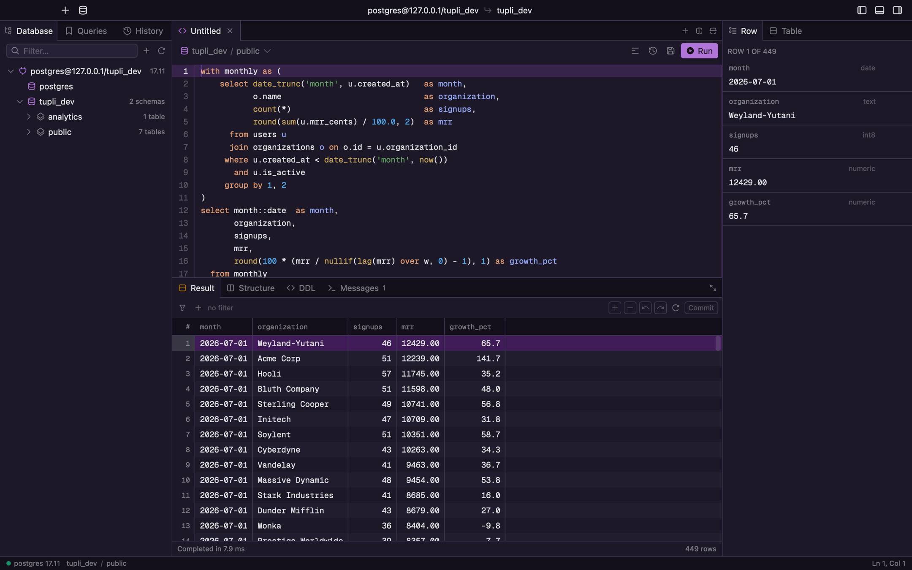

<div align="center">


# Tupli

**A native macOS database client, written in Rust on [GPUI](https://www.gpui.rs).**

Postgres is the engine it is built for. Redis and ClickHouse come through the same driver
boundary, and exist partly to prove the boundary is real.

Opens instantly. Scrolls a million rows without dropping a frame. Never blocks on the database.


<picture>
  <source media="(prefers-color-scheme: dark)" srcset="docs/media/tupli-dark.png">
  <source media="(prefers-color-scheme: light)" srcset="docs/media/tupli-light.png">
  
</picture>

</div>

---

> ### ⚠️ Alpha. In development.
>
> Tupli is being built in the open and is **not ready to be anyone's daily driver**. There
> is no release build, no signed download, no update channel and no upgrade path for the
> local store — it is `scripts/run.sh` or nothing. Things move, break and get renamed.
>
> It reads and writes real databases. Point it at something you can afford to be wrong
> about until it has more mileage on it.

## Why

TablePlus is fast and closed. pgAdmin is a web app in a wrapper. DataGrip is a JVM that
takes a minute to think about it. All three make you wait — on launch, on a wide table, on
a scroll to row 400,000.

GPUI is Zed's UI framework: GPU-composited, no DOM, no view hierarchy diffing. That buys a
result grid that is genuinely virtualized and a window that is on screen before you have
let go of the keys. Everything below the UI — connection pool, query execution,
introspection — is off the main thread by construction, so a slow query slows the query
and nothing else.

## What works today

**Connections** — saved connections in a local SQLite store, passwords in the macOS
Keychain (never in the database), `postgres://` URL paste-to-fill, SSL modes, connection
test with server version and latency, colour tag per connection that tints the whole
window. New Connection is a window of its own, like Settings, rather than a dialog over
the work.

**Browsing** — a schema tree that holds every connection at once, each with as many of its
databases open as you have been into; tables, views and materialized views under every one
of them; virtualized grid with frozen gutter, resizable columns, NULL and type-aware
rendering; keyset paging over large tables; per-column filters.

**Editing** — double-click a cell to edit it, type-checked against the column; inserts,
updates and deletes staged and applied in one transaction on **Commit**, with the exact
SQL shown before it runs. Tables without a primary or unique key are read-only, and the
inspector says so.

**Import and export** — read a delimited file into a table with the delimiter sniffed,
columns matched by name and a preview headed by the *target*'s column names; a ragged file
is refused by line number rather than padded into the wrong columns. Out again as TSV,
CSV, JSON, Markdown or `insert` statements — the whole result, the selection, or what a
filter left. Both run through the same transaction and the same read-only guard as an edit.

**Row and table inspector** — every column of the selected row with its type, expandable
for long values and pretty-printed JSON, one-click copy, Set NULL, and follow-the-foreign-key
to the referenced row. A `bytea` or a Redis blob can be run through a decoder chain —
`base64 → gzip → MessagePack`, PHP `serialize()`, or a hex dump that never fails — with
every step named, because the useful half of a wrong guess is knowing which step to change.
The Table tab carries the size, row estimate, owner, primary key and whether the relation
is writable at all.

**SQL** — tree-sitter-backed editor with syntax highlighting, completion for schemas,
tables and columns, statement-under-cursor detection, formatting, run (`⌘↵`) or run-all
(`⌘⇧↵`), cancellation (`⌘.`), and timing per statement.

**History** — one durable record of everything the app did: statements, commits, imports
and exports alike, with how long each took, what the server said on the side, and its own
words when it refused. Grouped by day, filterable down to just this window.

**Structure & DDL** — column, index, constraint and trigger lists; a structure editor that
stages changes and shows the `alter table` before it sends it; generated `CREATE`
statements for any object.

**Roles & privileges** — the roles a connection can see, their memberships and attributes,
and a per-relation privileges tab: which grantee holds which privilege, with `PUBLIC`
called out as the one worth noticing.

**The rest of the shell** — split panes, tabs with a context menu (close others, left,
right, unchanged; pin a tab and every bulk close steps over it), command palette (`⌘K`),
object jump (`⌘P`), query history, saved queries, settings window, and full light/dark
theming that reloads live.

## Engines

The app depends on `drivers` and `db`, never on an engine crate. What the UI branches on is
a flag on `Capabilities` — `editable_rows`, `transactions`, `schemas`, `roles` — so the
question is never "is this Redis?" but "can these rows be edited?".

| | |
|---|---|
| **PostgreSQL** 12 – 17 | The one it is built for. Wire protocol spoken directly, pooled, with introspection, cancellation and a real transaction around every commit. |
| **Redis** | Read-only, over RESP. A keyspace is *sampled* with `SCAN` rather than inventoried, and everything that reports on it says how much it looked at instead of pretending to a total. Hashes, lists, sets, sorted sets and streams all draw in the same grid. |
| **ClickHouse** | The native protocol on 9000, not the HTTP interface: a columnar block arrives laid out the way the grid wants it, so fifty thousand rows never become rows and back. Nothing generated, nothing wrapped. |

## Not there yet

SSH tunnelling · writing to Redis · ClickHouse beyond reading well · a signed release, an
update channel, or any upgrade path for the local store · anything that is not macOS.

## Build it

Rust 1.97 or newer, Xcode command line tools, macOS 13+.

```sh
git clone git@github.com:niranjannitesh/tupli.git
cd tupli
scripts/dev-identity.sh   # once — see below
scripts/run.sh
```

The first build compiles GPUI from source and takes a while. Subsequent ones do not.

`scripts/run.sh` rather than `cargo run`, because macOS reads an application's icon, its
name in the menu bar and its Keychain identity from the bundle and not from the executable:
a bare binary is a different, nameless application every time. The script builds, bundles,
replaces any running instance and opens the result.

`scripts/dev-identity.sh` creates a local self-signed code-signing certificate, once. Without
it every build is ad-hoc signed, which means a new code identity, which means the Keychain
asks for permission again on every launch. It is trusted only in your own keychain and means
nothing on any other machine.

Channels are separate applications, not one application wearing three icons: development,
preview and production each get their own name, bundle identifier and ribboned icon, so
you can run the one you are hacking on next to the one you rely on.

```sh
scripts/bundle.sh --channel preview --open
```

## Where it keeps things

| | |
|---|---|
| `~/Library/Application Support/tupli/tupli.db` | connections, history, saved queries, window state |
| `~/Library/Logs/tupli` | logs, where Console.app already looks |
| Keychain, service `tupli` | one generic password per connection, keyed by its UUID |

Deleting the first one resets the app. Passwords are never written to it.

## Themes

Themes are Zed theme JSON, so a theme written for Zed mostly works here. Bundled:
**Fleet** (Light, Dark, Dark Purple), **One** (Dark, Light), **Ayu** (Dark, Light, Mirage)
and **Gruvbox** (Dark and Light, each in three contrasts) — see
[`assets/themes`](assets/themes). Both appearances are first-class; the whole chrome
recolours live, without a restart.

## Keys

| | | | |
|---|---|---|---|
| `⌘K` | command palette | `⌘↵` | run statement |
| `⌘P` | jump to object | `⌘⇧↵` | run everything |
| `⌘⇧P` | commands only | `⌘.` | cancel |
| `⌘T` | new tab | `⌘R` | refresh results |
| `⌘W` `⌥⌘W` | close tab / close others | `⌘⇧R` | refresh schema |
| `⌘N` | new connection | `⌥⇧F` | format SQL |
| `⌘S` `⌘⇧S` | save query / save as | `F6` | follow foreign key |
| `⌘⇧I` `⌘⇧E` | import / export rows | `⌘C` `⌘⇧C` | copy / copy with headers |
| `⌘1` `⌘2` `⌘3` | sidebar / results / inspector | `⌘D` `⌘⇧D` | split right / down |
| `⌘,` | settings | | |

## Layout

```
crates/
  db             engine-agnostic types: connections, schemas, columns, values, errors
  db_pg          the Postgres driver — pooling, introspection, type decoding
  db_redis       Redis over RESP, read-only, sampled rather than inventoried
  db_clickhouse  ClickHouse's native protocol, hand-written, columnar end to end
  drivers        the registry; the only crate that knows the engines by name
  sqlgen         SQL the app writes rather than the user: DML from grid edits, DDL
  grid           the virtualized result grid, as a standalone element
  editor         the SQL editor: rope, tree-sitter, completion
  ui             design system — theme, buttons, tabs, menus, sheets, icons
  store          SQLite + Keychain: connections, history, saved queries
  tupli          the application: window, panes, sidebar, inspector, commands
```

`db` holds the shared vocabulary — rows, values, schemas, `Driver`, `Capabilities` — and
everything above the drivers is written against it. Adding an engine is a variant on
`db::Engine` and an arm in `drivers`; the app layer does not learn its name.

## Developing

```sh
cargo test --workspace          # 609 tests
cargo build --workspace --examples
```

There is a headless renderer for reviewing UI changes without a window — it renders both
appearances offscreen to PNG at 2×:

```sh
TUPLI_CONNECT="engine=postgres host=127.0.0.1 db=example user=postgres sslmode=disable" \
TUPLI_OPEN=public.users \
cargo run -p tupli --example screenshot -- /tmp/shot
```

Most of the interesting state is reachable through `TUPLI_*` environment variables for
exactly this reason — the sidebar tab, the results tab, a staged edit, an open menu, a
sheet, a split, the settings window — see `crates/tupli/examples/screenshot.rs`.

House rules, such as they are, are in [`CLAUDE.md`](CLAUDE.md): comments say *why*, tests
are named as sentences, and the tree is deliberately not `rustfmt --all` clean.

## Credits

[GPUI](https://github.com/zed-industries/zed) by Zed Industries. Themes adapted from their
upstream projects, each with its licence in [`assets/themes`](assets/themes). Icons are
the commercial [Nucleo](https://nucleoapp.com) set, used under licence — see
[`tools/README.md`](tools/README.md) before regenerating them.

## Licence

The code is [MIT](LICENSE).

The icons under `assets/icons/` are not: they are generated from the commercial
[Nucleo](https://nucleoapp.com) set and are used here under its licence, which the MIT
grant does not extend to. Reuse the code freely; bring your own icons. Bundled themes
carry their upstream licences alongside them in [`assets/themes`](assets/themes).
